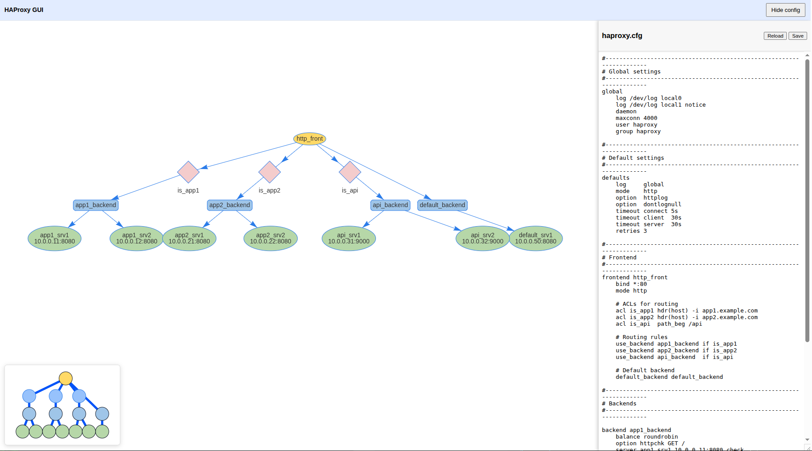

# HAProxy GUI (minimal)



This is a small prototype GUI for visualizing and editing a HAProxy configuration.

## Features
- Graphical view of `frontend` -> `backend` relationships
- Simple editor for the raw `haproxy.cfg` with save/reload
- PAM authentication

## Quick start
> **WARNING:** Backup your `haproxy.cfg` config file before proceeding.

```bash
docker compose up
```
